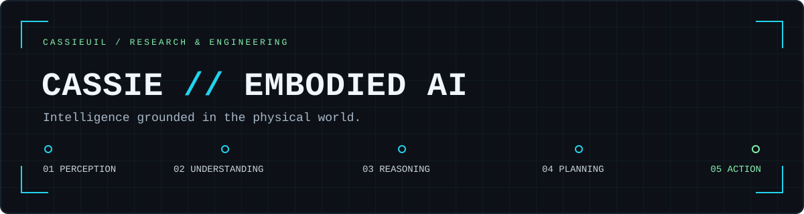

<div align="center">
  
</div>

## Hi, I'm Cassie

**Embodied AI & Robotics**

Building toward intelligent systems that can **perceive, understand, reason, plan, and act** in the physical world.

My work connects visual learning experiments, service-robot planning, and perception tooling. Computer vision and robotics are the technical paths; **Embodied AI is the direction**.

```text
> EMBODIED_AI
  Perception → Understanding → Reasoning → Planning → Action
```

### `01 // SELECTED WORK`

**[VideoMAE Research](https://github.com/CassieuiL/cv-research-videomae) · Understanding**

Video representation learning on UCF101: temporal sampling, inference clip ablations, and K400 / SSV2 pretraining transfer experiments in PyTorch.

**84.67% Top-1** reported with K400 pretraining, 16 frames, stride 4, and 5-clip inference; **83.40%** with 1-clip inference on the same checkpoint. [Experiment table](https://github.com/CassieuiL/cv-research-videomae/blob/master/results/tables/ablation_infer.csv) · [All configurations](https://github.com/CassieuiL/cv-research-videomae/blob/master/results/tables/all_results.csv)

**[RoboCup Home Service Planner](https://github.com/CassieuiL/robocup-home-service-sim) · Reasoning → Planning → Action**

A collaborative C++ project for service-robot simulation: reason over world state, resolve task constraints, and execute multiple goals with error recovery. Current work includes handling incorrect environment information and conflicting tasks.

**[Orbbec Live Collector](https://github.com/CassieuiL/orbbec-live-rgb-collector) · Perception**

RGB-D and multi-camera capture utilities for Orbbec Gemini 335L / 305, including RGB image collection for YOLO datasets and session metadata. A fork of [white-xr/orbbec-live-rgb-collector](https://github.com/white-xr/orbbec-live-rgb-collector); upstream authorship is retained.

**[CV Research 2026](https://github.com/CassieuiL/cv-research-2026) · Experimental Foundations**

CIFAR-10 / ResNet-18 training foundations with configuration files, seeded runs, TensorBoard logging, and checkpointing — supporting a disciplined approach to visual learning experiments.

### `02 // RESEARCH INTERESTS`

Embodied Intelligence · Robot Learning · Computer Vision · Video Understanding  
Robot Perception · Planning & Reasoning · Multimodal Learning

### `03 // TOOLKIT`

`Python` · `C++` · `PyTorch` · `OpenCV` · `TensorBoard` · `Git`  
Video learning experiments · RGB-D data capture · Simulation-based task planning

---

### `04 // CONTRIBUTION STREAM`

<picture>
  <source media="(prefers-color-scheme: dark)" srcset="https://raw.githubusercontent.com/CassieuiL/CassieuiL/output/github-contribution-grid-snake-dark.svg" />
  <source media="(prefers-color-scheme: light)" srcset="https://raw.githubusercontent.com/CassieuiL/CassieuiL/output/github-contribution-grid-snake.svg" />
  
</picture>

<sub>Generated with <a href="https://github.com/Platane/snk">Platane/snk</a> · Updated daily</sub>
